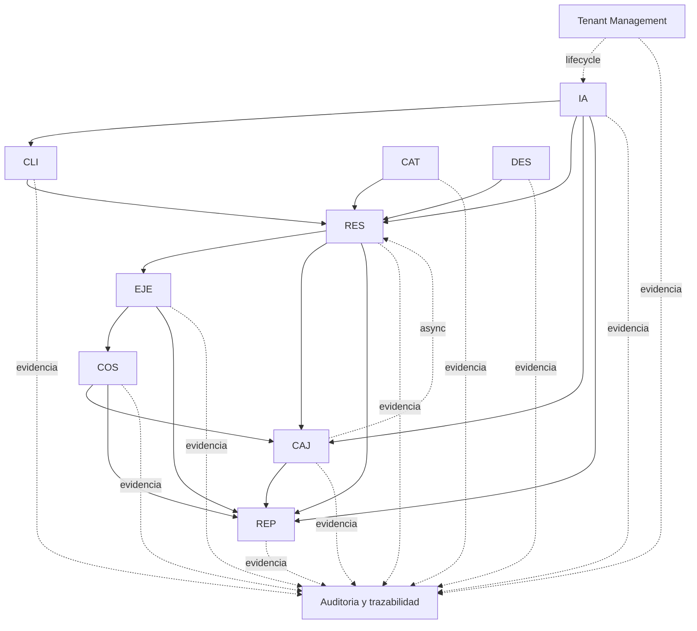

# Context Map - Plataforma Multitenencia para Operadores Turisticos

## 1. Objetivo

Este documento presenta el **Context Map** del producto a partir del analisis funcional consolidado del proyecto. Su proposito es describir el dominio desde la perspectiva de **Bounded Contexts**, mostrando:

- la descripcion general del negocio
- los contextos identificados
- la responsabilidad principal de cada contexto
- el lenguaje ubicuo asociado
- las relaciones y dependencias entre contextos
- la clasificacion de contextos en `Core`, `Supporting` y `Generic`
- las decisiones de modelado tomadas hasta este punto
- el impacto de la multitenencia sobre cada contexto

Este documento describe **fronteras de dominio y relaciones funcionales**. No define todavia APIs, contratos tecnicos, topologia de microservicios, bases de datos fisicas ni mecanismos de integracion.

## 2. Descripcion general del negocio

El producto se define como una **plataforma multitenencia para operadores turisticos de naturaleza y aventura**. Su finalidad es centralizar procesos que hoy suelen estar dispersos en archivos manuales o herramientas no integradas, especialmente en torno a:

- gestion de clientes
- gestion de reservas
- consulta de oferta operativa
- aplicacion de descuentos y reglas comerciales
- ejecucion real de los servicios prestados
- control de costos operacionales
- manejo de caja y consolidacion
- consulta administrativa mediante reportes y dashboard
- auditoria de operaciones relevantes

El caso de validacion funcional principal es **Travesia Natural**, que se mantiene como **tenant demo principal** del proyecto. Sin embargo, el producto ya no se modela como una solucion exclusiva para una sola empresa, sino como una plataforma donde varias empresas operan de manera aislada bajo el concepto de tenant.

## 3. Principio transversal de multitenencia

Todo el dominio debe leerse bajo las siguientes reglas:

- toda operacion ocurre dentro de un `tenant` previamente identificado
- ningun contexto puede mezclar datos entre tenants distintos
- las consultas, comandos, reportes, auditorias y trazas deben conservar el aislamiento por tenant
- una misma persona puede existir funcionalmente en mas de un tenant, pero sus relaciones operativas deben tratarse de forma separada
- Travesia Natural es el tenant demo principal de validacion y demostracion

La multitenencia no crea un contexto de negocio por si sola, pero si impone una restriccion transversal de modelado que afecta a todos los bounded contexts.

### Invariante transversal de multitenencia

Todos los comandos, consultas, eventos, reportes, auditorias y datos derivados que pertenezcan a la operacion del negocio deben conservar un `tenantId` confiable. Esta regla se deriva directamente del PDR y no implica que todos los bounded contexts dependan de forma sincrona de `Tenant Management`.

## 3.1 Definiciones formales minimas alineadas con el PDR

Para mantener consistencia con el PDR, en este documento se adoptan las siguientes definiciones:

- `Tenant`: empresa operadora que utiliza la plataforma con aislamiento de usuarios, datos, configuraciones y operacion respecto de otros tenants.
- `Identity`: representacion autenticable y verificable de un usuario del sistema, necesaria para autenticarlo, asociarlo a un alcance operativo y aplicar control de acceso.
- `User`: identidad autenticable del sistema con acceso a funciones segun rol y pertenencia a tenant.
- `Membership`: relacion entre un `User` y un `Tenant`, necesaria para determinar su alcance operativo dentro de la plataforma.
- `Role`: agrupacion base de permisos operativos confirmados por el PDR, por ejemplo `Administrador de plataforma`, `Administrador`, `Colaborador operativo` y `Cliente final`.
- `Permission`: autorizacion concreta para ejecutar una accion o consultar informacion dentro del tenant correspondiente.
- `Customer`: persona del dominio comercial y operativo que reserva, participa o se relaciona con los servicios del negocio. En el lenguaje del proyecto se modela como `Cliente`.

Estas definiciones no reemplazan el glosario del PDR; solo fijan el lenguaje minimo necesario para que el Context Map no entre en contradiccion con el documento principal.

## 4. Bounded Contexts identificados

Los bounded contexts identificados para el dominio actual son:

1. `Tenant Management`
2. `Identidad y acceso`
3. `Clientes`
4. `Reservas`
5. `Catalogo operativo`
6. `Descuentos y reglas comerciales`
7. `Ejecucion operativa`
8. `Costos operacionales`
9. `Caja y consolidacion`
10. `Reportes y dashboard`
11. `Auditoria y trazabilidad`

## 5. Context Map visual

## 6. Responsabilidad de cada bounded context

### 6.1 Tenant Management

**Responsabilidad principal**

Administrar el ciclo de vida del tenant dentro de la plataforma.

**Incluye**

- alta de tenant
- activacion, inactivacion y reactivacion
- estado operativo del tenant

**No incluye**

- autenticacion detallada
- ownership del usuario administrador inicial
- reservas
- caja
- operacion comercial diaria

### 6.2 Identidad y acceso

**Responsabilidad principal**

Resolver autenticacion, membresia y permisos base de usuarios internos y usuarios finales cuando aplique.

**Incluye**

- usuarios
- credenciales
- identidades autenticables
- autenticacion
- pertenencia a tenant
- permisos base por rol
- rol y credenciales del primer administrador del tenant una vez se materializa el alta administrativa definida por el PDR

**No incluye**

- datos comerciales del cliente
- ownership de reservas
- ownership de catalogos o caja
- decisiones administrativas transversales de plataforma ajenas a la membresia ordinaria de un tenant

### 6.3 Clientes

**Responsabilidad principal**

Mantener la informacion maestra de personas del dominio con relevancia comercial y operativa.

**Incluye**

- cliente titular
- acompanantes cuando apliquen como entidad de dominio persona
- datos personales
- datos de contacto
- consentimientos
- informacion sensible o de emergencia segun necesidad del negocio

**No incluye**

- autenticacion
- reglas de descuento
- estados economicos de reserva

### 6.4 Reservas

**Responsabilidad principal**

Gestionar la proyeccion comercial de los servicios solicitados por el cliente y su ciclo funcional y economico a nivel de negocio.

**Incluye**

- reserva
- acompanantes vinculados a la reserva
- servicios reservados
- valor proyectado
- valor final
- modalidad de pago
- estado de reserva
- estado de pago
- saldo pendiente
- saldo a favor pendiente
- disponibilidad comprometida para una reserva concreta
- reagendamiento vinculado

**No incluye**

- movimientos reales de caja
- costos operacionales reales
- ejecucion real del servicio
- ownership de descuentos maestros

### 6.5 Catalogo operativo

**Responsabilidad principal**

Mantener la informacion base reusable para venta y operacion.

**Incluye**

- atractivos
- hospedajes
- alimentacion
- transporte
- tarifas base
- capacidad parametrizada
- restricciones operativas
- politica de cupo por recurso

**No incluye**

- descuentos
- reservas transaccionales
- ejecucion real

### 6.6 Descuentos y reglas comerciales

**Responsabilidad principal**

Definir las reglas maestras de descuento y promocion aplicables a la venta.

**Incluye**

- descuentos vigentes
- vigencias
- prioridades
- acumulacion
- topes
- bases de calculo
- reglas de aplicacion
- motivos habilitados para descuentos adicionales

**No incluye**

- calculo final persistido de una reserva especifica como owner
- oferta operativa
- caja

### 6.7 Ejecucion operativa

**Responsabilidad principal**

Representar lo que realmente fue prestado en la operacion.

**Incluye**

- servicios efectivamente prestados
- servicios no prestados
- causales operativas
- novedades
- estado operativo real

**No incluye**

- valor comercial vendido como owner
- apertura o cierre de caja

### 6.8 Costos operacionales

**Responsabilidad principal**

Registrar y controlar los costos reales derivados de la ejecucion.

**Incluye**

- costos asociados a la prestacion real
- gastos operacionales relacionados con la operacion
- visibilidad de costo real para control interno

**Relacion con otros contextos**

Costos operacionales no ejecuta por si mismo movimientos de caja, pero sus resultados pueden servir como insumo para `Caja y consolidacion` cuando el negocio necesite reflejar pagos, egresos o consolidaciones asociados a la operacion real.

**No incluye**

- valor comercial de la reserva
- consolidacion de caja

### 6.9 Caja y consolidacion

**Responsabilidad principal**

Gestionar movimientos monetarios efectivos y consolidacion administrativa.

**Incluye**

- apertura y cierre diario
- base diaria
- ingresos
- pagos
- gastos
- egresos monetarios efectivos
- devoluciones ejecutadas
- historico
- consolidacion mensual

**No incluye**

- ownership del valor comercial proyectado de la reserva
- ownership de la oferta operativa

### 6.10 Reportes y dashboard

**Responsabilidad principal**

Construir vistas derivadas de consulta para seguimiento operativo y administrativo.

**Incluye**

- dashboard diario
- reportes de reservas
- vistas consolidadas
- indicadores operativos y administrativos

**No incluye**

- ownership transaccional del dominio fuente

### 6.11 Auditoria y trazabilidad

**Responsabilidad principal**

Conservar evidencia verificable de operaciones relevantes del sistema.

**Incluye**

- registro de autenticaciones
- cambios sensibles
- accesos a datos sensibles
- movimientos criticos
- evidencias de autorizacion
- relacion entre actor, tenant, fecha, hora y accion

**No incluye**

- toma de decisiones de negocio
- ownership de la transaccion original

## 7. Lenguaje ubicuo por contexto

| Contexto | Terminos principales del lenguaje ubicuo |
| --- | --- |
| Tenant Management | tenant, alta, activacion, inactivacion, reactivacion, tenant activo, tenant inactivo |
| Identidad y acceso | identity, usuario, autenticacion, credencial, rol, permiso, membresia, sesion, acceso autorizado, administrador inicial |
| Clientes | cliente, acompanante, documento, contacto, consentimiento, dato sensible, dato de emergencia |
| Reservas | reserva, estado de reserva, estado de pago, valor proyectado, valor final, saldo pendiente, saldo a favor, modalidad de pago, reagendamiento, decision comercial aplicada |
| Catalogo operativo | atractivo, hospedaje, alimentacion, transporte, tarifa base, capacidad configurada, restriccion operativa |
| Descuentos y reglas comerciales | descuento vigente, vigencia, prioridad, acumulacion, tope, promocion, descuento adicional |
| Ejecucion operativa | ejecucion, servicio prestado, servicio no prestado, novedad, no asistencia, causal operativa |
| Costos operacionales | costo operacional, costo real, costo derivado, gasto operacional |
| Caja y consolidacion | caja, base diaria, ingreso, pago, egreso monetario, devolucion, cierre, consolidacion mensual, movimiento efectivo |
| Reportes y dashboard | dashboard diario, reporte administrativo, indicador, consolidado, consulta |
| Auditoria y trazabilidad | evento auditado, evidencia, actor, tenant, fecha, hora, motivo, registro afectado |

## 8. Relaciones entre contextos

| Origen | Destino | Relacion funcional | Upstream / Downstream | Patron de relacion |
| --- | --- | --- |
| Tenant Management | Identidad y acceso | Materializa el ciclo de vida del tenant y habilita la existencia de membresias y del primer administrador. | `Tenant Management` upstream / `Identidad y acceso` downstream | Customer/Supplier |
| Tenant Management | Auditoria y trazabilidad | Debe dejar evidencia de altas, activaciones, inactivaciones, reactivaciones y acciones administrativas excepcionales sobre tenants. | `Tenant Management` upstream / `Auditoria y trazabilidad` downstream | Published Language |
| Identidad y acceso | Clientes | Permite autenticar y habilitar acceso cuando el cliente final interactua con el sistema mediante un lenguaje publicado minimo de identidad y acceso, sin transferir ownership de los datos comerciales del cliente. | `Identidad y acceso` upstream / `Clientes` downstream | Published Language |
| Identidad y acceso | Reservas | Resuelve quien ejecuta la accion y si tiene permisos para operar dentro del tenant. | `Identidad y acceso` upstream / `Reservas` downstream | Published Language |
| Clientes | Reservas | Reservas utiliza la identidad comercial y operativa del cliente titular y acompanantes. | `Clientes` upstream / `Reservas` downstream | Customer/Supplier |
| Catalogo operativo | Reservas | Reservas consulta oferta, tarifas, capacidad configurada y restricciones para construir y validar la reserva. | `Catalogo operativo` upstream / `Reservas` downstream | Open Host Service |
| Descuentos y reglas comerciales | Reservas | Reservas consulta descuentos aplicables y reglas comerciales para calcular el valor final. La decision aplicada debe persistirse en la reserva para no depender del estado futuro de la regla. | `Descuentos y reglas comerciales` upstream / `Reservas` downstream | Open Host Service |
| Reservas | Ejecucion operativa | La ejecucion parte de una reserva valida y mantiene trazabilidad con ella. | `Reservas` upstream / `Ejecucion operativa` downstream | Published Language |
| Ejecucion operativa | Costos operacionales | Los costos reales se derivan de lo efectivamente ejecutado. | `Ejecucion operativa` upstream / `Costos operacionales` downstream | Published Language |
| Costos operacionales | Caja y consolidacion | Los costos y gastos operacionales confirmados pueden servir como insumo para registrar o consolidar egresos monetarios y control administrativo interno. | `Costos operacionales` upstream / `Caja y consolidacion` downstream | Published Language |
| Reservas | Caja y consolidacion | Reservas publica hechos economicos del negocio, por ejemplo pago validado, devolucion aprobada o saldo a favor generado, sin convertir a Caja en owner de la reserva. | `Reservas` upstream / `Caja y consolidacion` downstream | Published Language |
| Caja y consolidacion | Reservas | Caja comunica de forma asincrona la ejecucion efectiva de movimientos relevantes, por ejemplo devoluciones ejecutadas o registros monetarios confirmados, y adicionalmente puede exponer consulta de trazabilidad administrativa cuando aplique. | `Caja y consolidacion` upstream / `Reservas` downstream | Published Language |
| Reservas | Reportes y dashboard | Las reservas alimentan vistas de seguimiento comercial y operativo preferiblemente mediante modelos derivados. | `Reservas` upstream / `Reportes y dashboard` downstream | Published Language |
| Ejecucion operativa | Reportes y dashboard | La ejecucion alimenta indicadores de prestacion real preferiblemente mediante modelos derivados. | `Ejecucion operativa` upstream / `Reportes y dashboard` downstream | Published Language |
| Costos operacionales | Reportes y dashboard | Los costos alimentan consultas de control interno y analisis preferiblemente mediante modelos derivados. | `Costos operacionales` upstream / `Reportes y dashboard` downstream | Published Language |
| Caja y consolidacion | Reportes y dashboard | La informacion monetaria consolidada alimenta reportes administrativos preferiblemente mediante modelos derivados. | `Caja y consolidacion` upstream / `Reportes y dashboard` downstream | Published Language |
| Todos los contextos operativos | Auditoria y trazabilidad | Cada contexto emite evidencia de operaciones relevantes dentro de su propia frontera. | Contextos operativos upstream / `Auditoria y trazabilidad` downstream | Published Language |

## 8.1 Tipo de comunicacion dominante

Para mantener coherencia con el PDR, este Context Map asume la siguiente tendencia de comunicacion a nivel de dominio:

- `Clientes -> Reservas`: sincrona, porque la reserva necesita resolver datos del cliente durante el flujo principal.
- `Catalogo operativo -> Reservas`: sincrona, porque la reserva necesita validar oferta, restricciones y capacidad configurada al momento de construir la venta.
- `Descuentos y reglas comerciales -> Reservas`: sincrona, porque la reserva necesita calcular el valor final con las reglas vigentes del caso.
- `Reservas -> Ejecucion operativa`: asincrona como tendencia deseable, porque la ejecucion reacciona a una reserva ya confirmada o lista para seguimiento.
- `Costos operacionales -> Caja y consolidacion`: asincrona como tendencia preferida, porque los costos y gastos confirmados deben poder reflejarse en consolidaciones o egresos sin acoplar el registro de costo al cierre monetario inmediato.
- `Reservas -> Caja y consolidacion`: asincrona como tendencia deseable, porque Caja debe reaccionar a hechos economicos del dominio sin bloquear la operacion comercial principal.
- `Caja y consolidacion -> Reservas`: asincrona para notificar movimientos o devoluciones efectivamente ejecutados y sincrona solo para consulta administrativa de trazabilidad cuando ya exista informacion registrada.
- `Todos los contextos operativos -> Reportes y dashboard`: asincrona preferida mediante modelos derivados.
- `Todos los contextos operativos -> Auditoria y trazabilidad`: asincrona preferida mediante evidencia publicada o registro desacoplado.

Esta seccion no reemplaza una definicion tecnica de integracion. Solo expresa la semantica de comunicacion mas consistente con el PDR actual.

## 9. Dependencias entre contextos

Desde la logica funcional actual, las dependencias mas importantes son:

- `Reservas` depende de `Clientes`, `Catalogo operativo`, `Descuentos y reglas comerciales`, `Identidad y acceso` y del `tenantId` ya resuelto
- `Ejecucion operativa` depende de `Reservas`
- `Costos operacionales` depende de `Ejecucion operativa`
- `Caja y consolidacion` puede consumir insumos provenientes de `Costos operacionales` para reflejar egresos o consolidaciones relacionadas con la operacion real
- `Caja y consolidacion` depende de hechos economicos originados en `Reservas` y de su propia logica interna
- `Reportes y dashboard` depende de multiples contextos fuente
- `Auditoria y trazabilidad` depende transversalmente de eventos relevantes emitidos por todos los contextos

En consecuencia, el centro funcional del negocio actual se concentra en la relacion entre:

- `Reservas`
- `Catalogo operativo`
- `Descuentos y reglas comerciales`
- `Clientes`

## 10. Clasificacion estrategica del dominio

| Contexto | Clasificacion | Justificacion |
| --- | --- | --- |
| Reservas | Core | Representa el nucleo comercial del producto y concentra la principal capacidad diferenciadora del negocio en Fase 1. |
| Catalogo operativo | Supporting | Es indispensable para operar, pero en el estado actual del PDR se comporta mas como informacion base habilitadora que como diferenciador competitivo principal. |
| Descuentos y reglas comerciales | Supporting | Tiene alto impacto comercial, pero el PDR actual todavia no demuestra que sea el principal diferenciador estrategico del producto frente al mercado. |
| Ejecucion operativa | Supporting | Es clave para cerrar el ciclo del servicio, pero su valor depende del proceso comercial ya definido. |
| Costos operacionales | Supporting | Complementa el control interno y la rentabilidad, pero no inicia el flujo principal del negocio. |
| Caja y consolidacion | Supporting | Es esencial para la operacion administrativa, aunque no define por si sola la propuesta central del producto. |
| Clientes | Supporting | Es necesario para operar reservas, pero no constituye el principal diferenciador de la solucion. |
| Tenant Management | Generic | Resuelve una capacidad transversal de plataforma necesaria para multitenencia, pero no es el core comercial del negocio turistico. |
| Identidad y acceso | Generic | Corresponde a una capacidad comun de plataforma y seguridad. |
| Reportes y dashboard | Supporting | Aporta seguimiento operativo y administrativo util para el negocio, aunque no concentra ownership transaccional del dominio. |
| Auditoria y trazabilidad | Generic | Responde a una capacidad transversal de control y evidencia. |

## 11. Decisiones de modelado tomadas

Hasta este punto, el dominio queda modelado con las siguientes decisiones:

- `Reservas` y `Ejecucion operativa` son contextos distintos porque una cosa es lo vendido y otra lo realmente prestado.
- `Catalogo operativo` y `Descuentos y reglas comerciales` se modelan por separado para no mezclar oferta base con reglas promocionales.
- `Clientes` e `Identidad y acceso` son contextos distintos porque persona del dominio y seguridad no representan la misma responsabilidad.
- `Tenant Management` se mantiene separado de `Identidad y acceso` porque administrar el ciclo de vida del tenant no equivale a autenticar usuarios.
- el `Administrador de plataforma` es una figura transversal de plataforma y no debe confundirse con los roles ordinarios derivados de la `Membership` de un tenant.
- el `primer administrador` nace como efecto del alta administrativa del tenant, pero su identity, credenciales, rol y membresia pertenecen a `Identidad y acceso`.
- `Caja y consolidacion` es owner de los movimientos monetarios efectivos, mientras `Reservas` conserva el estado economico funcional de la reserva.
- `Reservas` conserva la decision comercial aplicada al caso concreto, por lo que no debe recalcular historicos a partir del estado actual de catalogos o descuentos.
- `capacidad configurada` pertenece a `Catalogo operativo`, mientras la disponibilidad comprometida para una reserva concreta y cualquier apartamiento temporal de cupo pertenecen al proceso de `Reservas`, de acuerdo con las reglas de concurrencia y cupo descritas por el PDR.
- `gasto operacional` y `costo operacional` no son equivalentes a `egreso monetario`; el egreso monetario efectivo pertenece a `Caja y consolidacion`.
- `Reportes y dashboard` no debe convertirse en owner de datos operativos, sino en consumidor de informacion derivada.
- `Auditoria y trazabilidad` se trata como capacidad transversal y no como reemplazo del ownership de cada contexto.
- la multitenencia se asume como una restriccion transversal del dominio, no como permiso para compartir datos entre contextos o tenants de forma ambigua

## 11.2 Semanticas que deben leerse conforme al PDR

### Capacidad y cupo

- `Catalogo operativo` define la capacidad configurada y las restricciones base del recurso.
- `Reservas` decide si esa capacidad pasa a convertirse en disponibilidad comprometida para una reserva concreta.
- Cuando el negocio habilite apartamiento temporal, dicho apartamiento pertenece a `Reservas`, no al catalogo.
- La regla del ultimo cupo y la concurrencia deben mantenerse alineadas con lo ya descrito por el PDR.

### Estado economico y movimientos efectivos

- `Reservas` es owner del estado economico funcional de la reserva: saldo, estado de pago, modalidad y decision comercial aplicada.
- `Caja y consolidacion` es owner del movimiento monetario efectivo: ingreso, egreso, devolucion, base diaria y cierre.
- `Costos operacionales` es owner del costo real derivado de la ejecucion.
- `Gasto operacional` puede existir como categoria de control interno, pero no debe confundirse con el costo real ni con cualquier egreso monetario ejecutado en caja.

## 11.1 Reglas de integracion alineadas con el PDR

- Todo contrato tenant-scoped debe propagar `tenantId` de forma explicita y confiable.
- Ningun bounded context debe acceder directamente a tablas, colecciones o modelos persistentes propiedad de otro bounded context.
- La comunicacion con `Reportes y dashboard` y `Auditoria y trazabilidad` debe preferir hechos publicados o modelos derivados, evitando fan-out sincrono innecesario.
- El Context Map describe relaciones de dominio; la definicion tecnica final de sincronismo, transporte, almacenamiento y despliegue debera mantenerse alineada con el PDR y resolverse en arquitectura.

## 12. Impacto de la multitenencia por contexto

| Contexto | Impacto de la multitenencia |
| --- | --- |
| Tenant Management | Define la existencia, estado y control administrativo de cada tenant. |
| Identidad y acceso | Los usuarios, membresias y permisos deben resolverse dentro del tenant correspondiente. |
| Clientes | La informacion del cliente debe aislarse por tenant, aun cuando una misma persona exista en mas de uno. |
| Reservas | Toda reserva pertenece a un tenant y no puede consultar ni modificar reservas de otro tenant. |
| Catalogo operativo | La oferta, capacidades y parametrizaciones pueden variar por tenant y no deben cruzarse. |
| Descuentos y reglas comerciales | Las promociones y reglas pueden ser distintas por tenant y deben aplicarse solo dentro de su contexto. |
| Ejecucion operativa | La prestacion real se registra sobre reservas del mismo tenant y no admite mezcla de operacion. |
| Costos operacionales | Los costos reales se consolidan solo sobre operaciones del tenant correspondiente. |
| Caja y consolidacion | Caja, devoluciones, gastos y consolidaciones deben mantenerse aislados por tenant. |
| Reportes y dashboard | Las vistas deben construirse con filtros y aislamiento estricto por tenant. |
| Auditoria y trazabilidad | Cada evento auditado debe registrar el tenant para garantizar evidencia y segregacion. |

## 13. Lectura final del mapa

La lectura recomendada del dominio es la siguiente:

- el producto tiene un **nucleo comercial** centrado en `Reservas`
- ese nucleo depende de informacion maestra de `Clientes`, `Catalogo operativo` y `Descuentos y reglas comerciales`
- la operacion posterior se extiende hacia `Ejecucion operativa`, `Costos operacionales` y `Caja y consolidacion`
- `Reportes y dashboard` y `Auditoria y trazabilidad` consumen o evidencian hechos del resto del dominio
- `Tenant Management` e `Identidad y acceso` proveen capacidades transversales de plataforma necesarias para que todo opere correctamente en un entorno multitenencia

En terminos de bounded contexts, el proyecto ya cuenta con una base consistente para seguir refinando actividades de analisis y modelado sin anticipar todavia la arquitectura fisica final.

## 14. Observaciones

- Este Context Map actualiza el trabajo conceptual de `02-week` con el enfoque vigente del PDR.
- El documento sigue siendo un mapa de dominio, no una definicion de microservicios.
- Travesia Natural se mantiene como tenant demo principal, pero la solucion completa ya se entiende como plataforma multitenencia.
- Cualquier cambio futuro en fronteras de contexto debe justificarse de forma explicita para no romper la consistencia del modelo.
