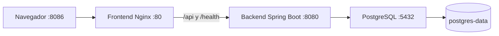

# Semana 06 · Sesión 1: sistema completo con Docker Compose

## Actividad

Poner en marcha Multi Tour con un único `docker compose up`: frontend Angular
servido por Nginx, backend Spring Boot y PostgreSQL 16. Incluye red compartida,
comprobaciones de salud que condicionan el inicio, configuración por entorno y
persistencia en un volumen nombrado.

La entrega es autónoma: el código necesario está en `frontend/` y `backend/`.
No requiere los repositorios originales ni los archivos de la semana 5 para construir.
La definición de entornos y el plan de orquestación para MVP 2 corresponden a Sesión 2.

## Ejecutar

Requisitos: Docker Engine o Docker Desktop en ejecución y Docker Compose v2.
Desde la raíz de este repositorio:

```powershell
cd "06-week/hu-status/Sesión 1"
docker compose up
```

La primera ejecución construye las imágenes y descarga sus dependencias. Al terminar
el inicio, abrir **http://localhost:8086**. No hay que arrancar servicios por separado.
Para dejarlo en segundo plano y esperar a que esté saludable:

```powershell
docker compose up -d --wait --wait-timeout 240
docker compose ps
```

Después de modificar código, ejecutar `docker compose up --build -d --wait`.
Para detener y eliminar contenedores y red conservando los datos: `docker compose down`.
`docker compose down -v` también elimina los datos; no se usa para esta actividad.

## Arquitectura y orden de inicio



Los tres contenedores pertenecen a `multitour-week06_multitour`. El backend resuelve
`postgres` por DNS de Docker y Nginx resuelve `backend`. Solo el frontend publica un
puerto, vinculado a `127.0.0.1`; la API y la base de datos son internas.

| Servicio | Comprobación | Condición para iniciar |
| --- | --- | --- |
| PostgreSQL | `pg_isready` con usuario y base configurados | Sin dependencia |
| Backend | HTTP `/health`, ejecuta `SELECT 1`; devuelve 503 si falla la BD | PostgreSQL `service_healthy` |
| Frontend | HTTP `/health` a través del proxy hacia el backend | Backend `service_healthy` |

El backend aplica las migraciones Flyway del sistema al arrancar. La comprobación
del frontend verifica también la conexión Nginx → API → BD. El script comprueba por
separado que `/` entrega la aplicación Angular.

`depends_on` con `service_healthy` espera a que la dependencia esté preparada,
según la [documentación oficial de Docker](https://docs.docker.com/compose/how-tos/startup-order/).
Este control actúa durante el inicio: un estado `unhealthy` posterior no provoca por
sí solo el reinicio del contenedor. `restart: unless-stopped` atiende salidas del proceso;
la API puede recuperar su conexión cuando vuelve PostgreSQL.

## Configuración y datos

`compose.yaml` incluye valores de demostración para permitir el comando único sin
preparación adicional. Se pueden sustituir mediante variables del shell o copiando
`.env.example` a `.env` y editándolo antes del primer arranque.

| Variable | Valor local predeterminado | Uso |
| --- | --- | --- |
| `FRONTEND_PORT` | `8086` | Puerto del navegador |
| `POSTGRES_DB` | `multitour` | Base de datos |
| `POSTGRES_USER` | `multitour` | Usuario de la BD |
| `POSTGRES_PASSWORD` | Valor de demo en `.env.example` | Credencial inyectada al arrancar |
| `APP_JWT_SECRET` | Valor de demo en `.env.example` | Firma de tokens del backend |
| `API_UPSTREAM` | `backend:8080` | Destino del proxy; Nginx lo toma del entorno |

Las credenciales predeterminadas son públicas y exclusivas de la demo local. `.env`
está ignorado por Git y excluido de los contextos Docker. El backend conserva los
datos iniciales y las reglas del sistema original, incluido su usuario de demo.

El volumen `multitour-week06_postgres-data` se monta en `/var/lib/postgresql/data`.
Sobrevive a `down` y a la recreación de contenedores. Cambiar las variables de
PostgreSQL no modifica las credenciales de una base que ya fue inicializada.

## Verificación reproducible

```powershell
powershell -ExecutionPolicy Bypass -File .\verificar.ps1
```

Si se cambió el puerto, pasar `-BaseUrl http://localhost:PUERTO`.
El script falla ante un resultado inesperado y guarda la ejecución en
`Evidencias/02-verificacion.txt`. Comprueba:

1. Los tres servicios saludables y el frontend HTTP 200.
2. Salud a través del proxy con BD disponible.
3. Creación de un tenant por la API real, respuesta 201 y consulta posterior.
4. Persistencia del mismo tenant tras `down` y `up`.
5. Respuesta 503 al detener PostgreSQL y recuperación al arrancarlo.
6. Miembros de la red compartida y volumen nombrado.

La prueba interrumpe temporalmente **este proyecto** de Compose y deja un tenant de
demostración con identificador único. El proyecto tiene nombre propio para convivir
con el despliegue de Multi Tour que ya usa los puertos 8080 y 8081.

## Procedencia y cambios de esta entrega

Se copiaron únicamente fuentes y archivos necesarios para construir desde los
repositorios locales, sin `.git`, `.env`, `node_modules` ni artefactos compilados:

| Componente | Repositorio local de origen | HEAD de referencia |
| --- | --- | --- |
| Frontend | `Multitour-Monolito-Portal/Multitour-Monolito-Portal` | `06fdefdadfcb66b0373973915e88304f6d098138` |
| Backend | `Multitour-Monolito-Portal/Multitour-Monolito-Api/Multitour-Monolito-Api` | `a867eb4c930bdfe13633891a53a607009948264a` |

La copia corresponde al árbol de trabajo local, incluidos los cambios existentes
del frontend sin commit; no es una exportación exacta del HEAD. Los listados
`Evidencias/00-estado-origen-*.txt` registran ese estado (backend sin cambios).

En la copia de esta sesión se cambió el build frontend a `npm ci`, se incorporó la
plantilla Nginx configurable por entorno y se amplió `/health` para consultar la BD.
Se desactivó únicamente la incorporación de fuentes remotas durante el build Angular:
la primera construcción falló al descargar Google Fonts. El navegador puede seguir
cargando esas fuentes, con las alternativas CSS si no tiene acceso a Internet.
Los Dockerfiles conservan construcción multietapa. La semana 5 contenía un ejercicio
con `tenant-service`; esta entrega utiliza los componentes del sistema Multi Tour.

Las comprobaciones de esta actividad cubren orquestación, conectividad y persistencia;
no equivalen a certificar todos los flujos funcionales del MVP.

## Resultado de la ejecución real

Verificado el **13 de septiembre de 2026**, con Docker Engine 29.2.0:

| Criterio | Resultado |
| --- | --- |
| Construcción y arranque completo | Correcto; los tres servicios `healthy` |
| Frontend | HTTP 200 y documento Angular presente |
| Salud a través de Nginx | `status: UP`, `database: UP` |
| Escritura y lectura mediante API | POST 201; tenant `week06-1a0a8276ad10` |
| Persistencia tras eliminar y recrear contenedores | Mismo tenant y contenido recuperados |
| Pérdida de la BD | `/health` devolvió HTTP 503 |
| Recuperación de la BD | Salud UP y los tres servicios saludables |
| Red | PostgreSQL, backend y frontend en `multitour-week06_multitour` |
| Volumen | `multitour-week06_postgres-data`, driver local |

Evidencias:

- [Construcción y arranque](Evidencias/01-arranque.txt).
- [Prueba completa de HTTP, persistencia y recuperación](Evidencias/02-verificacion.txt).
- [Estado final de los servicios](Evidencias/03-estado-final.json),
  [red compartida](Evidencias/04-red.txt) y [volumen](Evidencias/05-volumen.txt).
- [Primer intento: fallo de descarga de fuentes, corregido](Evidencias/01-intento-inicial-fonts.txt).

El build Angular terminó con advertencias de tamaño del bundle inicial y de
`auth-visual.css`; no superó los umbrales de error. Los Dockerfiles compilan el
sistema, pero omiten la ejecución de la suite unitaria del backend. La evidencia
de validación de esta sesión es la prueba de integración `verificar.ps1`.
