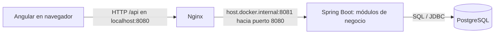
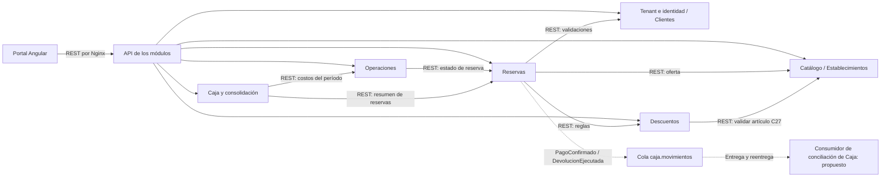
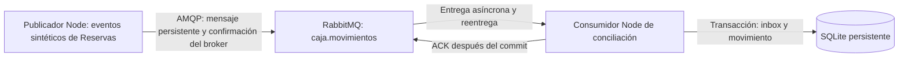

# Semana 07 · Sesión 1: comunicaciones de Multi Tour

## Objetivo y alcance

Decidir quién inicia cada interacción, quién la recibe, si necesita respuesta inmediata y qué tecnología utilizar. Se incluye una demostración ejecutable de un consumidor idempotente. Los contratos versionados se elaborarán en la sesión 2.

La base es el código original ubicado en `C:/www/sistemas-distribuido/Multitour-Monolito-Portal`: frontend Angular en `Multitour-Monolito-Portal/` y backend Spring Boot en `Multitour-Monolito-Api/Multitour-Monolito-Api/`. No se utilizan las copias de la semana 06 como fuente de implementación. `Reservas`, `Catálogo`, `Operaciones` y `Caja` son actualmente módulos del mismo proceso, **no microservicios desplegados**. El ejercicio de `tenant-service` de semanas anteriores no se agrega como un segundo backend del sistema.

La matriz cubre los flujos funcionales de los módulos existentes y las dependencias necesarias para su separación. Las filas agrupan operaciones cuando comparten origen, destino, decisión y justificación. Las llamadas REST entre módulos siguen como diseño. La mensajería está implementada y verificada en un laboratorio de esta sesión con RabbitMQ real, publicador y consumidor independientes, y persistencia SQLite. El publicador usa datos sintéticos en representación de Reservas; no se alteran el backend original ni sus reglas de pago/caja.

## Fuentes del proyecto

- [PDR Multi Tour 1.7](../../../04-week/hu-status/PDR_Multi_tour_v1.7.md): alcance funcional, multitenencia, cupos y modalidades de pago.
- [ADR de responsabilidades](../../../04-week/hu-status/Sesión%202/ADR-001-mvp1-ownership-contexts.md): Reservas conserva el estado económico de la reserva; Caja recibe los movimientos efectivos.
- [Backend original](../../../../Multitour-Monolito-Portal/Multitour-Monolito-Api/Multitour-Monolito-Api/src/main/java/com/corhuila/errorcapa8/travesia_natural): controladores, dominio y servicios de aplicación revisados.
- [Frontend original](../../../../Multitour-Monolito-Portal/Multitour-Monolito-Portal/src/app): servicios HTTP y componentes que los utilizan.
- [Trazabilidad de la revisión](trazabilidad-repos-originales.md): rutas, archivos, revisiones y diferencias entre implementación y propuesta. Los enlaces a los repositorios hermanos funcionan en este workspace; el documento conserva también sus rutas para una entrega fuera de él.

En particular, `CreateReservationService` consulta tenants y catálogo; `RegisterPaymentService` registra efectivo, abono o transferencia; `DecidePaymentSupportService` valida permisos; `MonthlyCashConsolidationService` consulta reservas y costos operacionales. Estos accesos hoy son locales mediante repositorios. No se afirma que ya existan llamadas REST entre esos módulos.

## Mapa de comunicación

Situación actual con Docker, según `nginx.conf` del frontend y los Compose originales:



En desarrollo con `ng serve`, `proxy.conf.json` reenvía `/api` y `/health` a `http://localhost:8080`; no se usa Nginx. En Docker, Nginx solo tiene proxy para `/api/`, no para `/health`. El `HealthController` original responde `{"status":"UP"}` sin consultar la BD; por tanto no acredita conectividad PostgreSQL.

El Compose del backend usa otro endpoint para su healthcheck: `/actuator/health`, con Spring Boot Actuator instalado. No debe confundirse con `/health`. Además, su servicio `frontend` apunta a `../Frontend`, carpeta inexistente en este workspace. El mapa describe el proxy del frontend original y los puertos configurados, no certifica que el Compose completo arranque sin ajustes. No se ejecutó ni modificó ese despliegue para esta actividad.

Diseño de interacciones si se separan los módulos:



Las flechas discontinuas representan mensajería propuesta. El consumidor guarda una bandeja de conciliación independiente: no escribe automáticamente en las cajas operativas ni en su saldo. Nginx es un proxy, no otro servicio de negocio. Las validaciones de tenant compartidas se detallan en la matriz para evitar saturar el diagrama.

Comunicación ejecutable incorporada a esta entrega:



El diagrama anterior de separación de módulos sigue siendo una propuesta de integración con Java. Este segundo diagrama sí tiene implementación en la carpeta de la sesión.

## Matriz de decisiones

**Estado:** A = interacción HTTP actual; P = comunicación propuesta al separar módulos; L = implementada en el laboratorio RabbitMQ de esta entrega. **Idempotente:** N/A significa que la fila no corresponde a un consumidor asíncrono; no implica que un POST sea seguro ante reintentos.

| ID | Origen | Destino | Interacción | Tipo | Tecnología | Justificación específica | Consumidor idempotente | Estado |
| --- | --- | --- | --- | --- | --- | --- | --- | --- |
| C01 | Portal | Tenant Management | Crear, consultar y activar/desactivar tenant | Síncrona | REST/JSON | El administrador necesita confirmar el alta o estado antes de operar; recursos HTTP accesibles desde Angular. | N/A | A |
| C02 | Portal | Identidad y acceso | Iniciar sesión | Síncrona | REST/JSON | La navegación autenticada requiere recibir el token o el rechazo en esa solicitud. | N/A | A |
| C03 | Portal | Clientes / colaboradores | Registrar clientes; registrar y consultar colaboradores | Síncrona | REST/JSON | El formulario necesita conocer validaciones y el resultado antes de continuar. El interruptor de permisos del portal aún es local y no se incluye como escritura HTTP. | N/A | A |
| C04 | Portal | Establecimientos | Crear, consultar y activar/desactivar establecimientos | Síncrona | REST/JSON | La selección y administración requieren conocer el establecimiento vigente. | N/A | A |
| C05 | Portal | Catálogo | Consultar y administrar oferta, transporte y tarifas | Síncrona | REST/JSON | El usuario necesita los datos para seleccionar el servicio y ver su precio. | N/A | A |
| C06 | Portal | Descuentos | Consultar, crear, actualizar y activar/desactivar reglas | Síncrona | REST/JSON | Debe mostrarse la regla vigente y el resultado de su validación en el formulario. | N/A | A |
| C07 | Portal | Reservas | Crear, consultar, modificar o cancelar reserva | Síncrona | REST/JSON | El usuario debe conocer aceptación, rechazo y estado confirmado antes de continuar. | N/A | A |
| C08 | Portal | Reservas | Aplicar descuento | Síncrona | REST/JSON | Se necesita devolver el valor recalculado o el rechazo antes de registrar el pago. | N/A | A |
| C09 | Portal | Reservas | Registrar pago, decidir soporte y consultar/registrar seguimientos | Síncrona | REST/JSON | El operador necesita saber si quedó registrado o pendiente de validación; la respuesta no espera la consolidación en Caja. | N/A | A |
| C10 | Portal | Reservas | Solicitar, autorizar o rechazar devolución; registrar saldo a favor | Síncrona | REST/JSON | El operador requiere conocer la transición permitida y su resultado; autorizar no equivale a ejecutar un desembolso. | N/A | A |
| C11 | Portal | Operaciones | Registrar/consultar ejecución y costos | Síncrona | REST/JSON | El operador necesita confirmar que el dato quedó asociado a la reserva correcta. | N/A | A |
| C12 | Portal | Reservas | Finalizar reserva | Síncrona | REST/JSON | Debe informarse inmediatamente si el estado permite finalizar y cuál es el resultado. | N/A | A |
| C13 | Portal | Caja | Abrir, consultar, registrar movimientos/correcciones y cerrar caja | Síncrona | REST/JSON | El responsable necesita confirmación y validación del estado de caja antes de continuar. | N/A | A |
| C14 | Portal | Caja y consolidación | Consultar consolidado mensual | Síncrona | REST/JSON | El reporte actual es una consulta que devuelve el resumen para mostrarlo; no se ha demostrado necesidad de un trabajo pesado en segundo plano. | N/A | A |
| C15 | Portal | Auditoría | Consultar registros | Síncrona | REST/JSON | La pantalla necesita los registros solicitados para mostrar la trazabilidad. | N/A | A |
| C16 | Reservas | Tenant Management | Validar existencia y estado del tenant | Síncrona | REST/JSON | No se debe aceptar la operación sin confirmar el tenant; REST facilita reutilizar la consulta existente. | N/A | P |
| C17 | Catálogo, Establecimientos, Descuentos, Operaciones y Caja (cada uno) | Tenant Management | Validar tenant antes de operar | Síncrona | REST/JSON | Cada iniciador debe rechazar operaciones de tenants inexistentes/inactivos; necesita el resultado antes de guardar. | N/A | P |
| C18 | Reservas | Identidad y acceso / Clientes | Validar pertenencia del cliente y permisos del actor | Síncrona | REST/JSON | La autorización y el aislamiento por tenant deben resolverse antes de modificar pagos, reservas o soportes. | N/A | P |
| C19 | Reservas | Catálogo | Validar oferta activa y obtener tarifa/transporte | Síncrona | REST/JSON | La reserva necesita la información vigente para calcular y aceptar el servicio; una respuesta tardía podría confirmar una selección inválida. | N/A | P |
| C20 | Reservas | Descuentos | Consultar elegibilidad y regla aplicable (dependencia nueva) | Síncrona | REST/JSON | El importe final debe quedar definido antes de confirmar el descuento. Hoy se aplica el porcentaje recibido; consultar el módulo de reglas es una evolución propuesta. | N/A | P |
| C21 | Operaciones | Reservas | Validar existencia y estado para ejecución/costos | Síncrona | REST/JSON | Debe rechazarse una referencia inválida antes de registrar la operación. | N/A | P |
| C22 | Caja y consolidación | Reservas | Consultar resumen de cancelaciones y devoluciones del período | Síncrona | REST/JSON | El cálculo solicitado necesita estos datos; una API de resumen evita transferir todas las reservas o leer tablas ajenas. | N/A | P |
| C23 | Caja y consolidación | Operaciones | Consultar costos agregados del período | Síncrona | REST/JSON | El reporte requiere el total del período en la misma consulta; REST permite pedir un agregado pequeño. | N/A | P |
| C24 | Módulo que modifica una operación auditable | Auditoría | Registrar trazabilidad | Síncrona | REST/JSON si se separa | Las acciones sensibles necesitan confirmar su trazabilidad. En el monolito se conserva escritura local; al separar se requiere clave de operación y recuperación ante fallo parcial. | N/A | P |
| C25 | Publicador de prueba en representación de Reservas | Consumidor real de conciliación | Informar `PagoConfirmado` sintético | Asíncrona | Cola RabbitMQ `caja.movimientos` | El productor termina al recibir confirmación del broker, sin esperar al consumidor. La conciliación admite demora y tiene un único destinatario lógico; no modifica una caja operativa. | **Sí: inbox transaccional + clave de movimiento** | L |
| C26 | Publicador de prueba en representación de Reservas | Consumidor real de conciliación | Informar `DevolucionEjecutada` sintético | Asíncrona | Cola RabbitMQ `caja.movimientos` | La conciliación diferida no bloquea al productor; un saldo a favor no representa este hecho. No se ejecuta ninguna transferencia bancaria. | **Sí: mismo mecanismo, otro movementId** | L |
| C27 | Descuentos | Catálogo | Validar artículo al crear descuento | Síncrona | Actual: repositorio local; REST/JSON al separar módulos | `CreateDiscountService` consulta el artículo por tenant e ID antes de guardar la regla. Necesita respuesta inmediata para rechazar referencias inexistentes. REST es suficiente para consultar ese recurso; no se justifica gRPC. | N/A | P (la consulta local ya existe) |

Las interacciones con infraestructura y almacenamiento local no se fuerzan a REST/gRPC:

| Origen | Destino | Interacción | Tipo / tecnología actual | Justificación |
| --- | --- | --- | --- | --- |
| Nginx (Docker) | Backend | Reenviar `/api/` | Síncrona / proxy HTTP | La respuesta del navegador depende de la respuesta del backend. |
| Servidor Angular (desarrollo) | Backend | Reenviar `/api` y `/health` | Síncrona / proxy HTTP | Permite consumir la API desde el origen del servidor de desarrollo. |
| Backend | PostgreSQL | Consultar/persistir mediante repositorios | Síncrona / SQL, JPA y JDBC | Los casos de uso esperan el resultado de persistencia. |
| Cliente de diagnóstico | Backend | Consultar `/health` | Síncrona / HTTP GET | Devuelve estado del proceso; no comprueba la BD. |
| Perfil del cliente en Angular | `localStorage` | Leer/editar nombre y teléfono locales | Síncrona / API del navegador | La pantalla guarda el perfil en este navegador; no existe una actualización HTTP de perfil en este flujo. |
| Sesión de Angular | `sessionStorage` | Guardar/leer sesión y limpiarla al salir | Síncrona / API del navegador | El portal conserva su sesión local; cerrar sesión en este flujo no llama a un endpoint de revocación. |
| Pantalla de colaboradores | Servicio local de roles / `localStorage` | Cambiar permiso visual de validación de soportes | Síncrona / almacenamiento local | El interruptor todavía no llama al PATCH existente en el backend; no prueba un cambio de autorización del servidor. |
| Cliente API administrativo (integración del portal pendiente) | Tenant Management | PATCH `/api/tenants/{tenantId}/collaborator-support-permission` | Síncrona / REST | El endpoint existente devuelve el tenant actualizado; una futura integración debe confirmar este resultado antes de mostrar el permiso como guardado en servidor. |
| Healthcheck Docker del backend | Actuator del backend | GET `/actuator/health` | Síncrona / HTTP | Compose espera el resultado de salud; es distinto del controlador `/health` y no se probó en ejecución en esta revisión. |

Las llamadas entre objetos del monolito siguen siendo locales. Las operaciones auditables requieren atomicidad local o recuperación explícita; no se acredita que todas las escrituras actuales de negocio y auditoría compartan una transacción. Una llamada remota tampoco crea por sí sola una transacción distribuida. Usar `Observable` en Angular no convierte HTTP petición/respuesta en mensajería asíncrona entre servicios.

Registro de clientes y login sí llaman al backend. Recuperar contraseña no tiene un flujo de envío de código/correo implementado: `RecoverComponent` informa esa limitación. No se inventa una interacción de notificaciones para esa pantalla.

### Por qué REST y cola

Se elige REST en las comunicaciones síncronas porque el portal ya consume HTTP/JSON y los flujos son consultas y comandos de negocio sin una necesidad medida de streaming ni de optimización binaria. Ser una llamada interna no basta para introducir gRPC. No es obligatorio usar las cuatro tecnologías para cumplir la actividad.

Se elige una cola para Caja porque hay un único destinatario lógico del movimiento. Varias instancias de Caja competirían por esa misma cola; no deben recibir una copia por instancia. Un topic/pub-sub se justificaría si aparecieran varios consumidores independientes que necesitaran el mismo hecho, cada uno con su propia suscripción. Esa ampliación no forma parte del alcance actual.

## Reglas de consistencia y fallos

- **Pagos:** `PagoConfirmado` representa dinero confirmado, no un intento ni un soporte pendiente. Una transferencia rechazada no lo genera. Cada abono confirmado tiene un `movementId` distinto. No se incorpora pasarela de tarjetas, excluida del alcance actual del PDR.
- **Publicador implementado:** publica mensajes persistentes en cola durable y espera confirmación de RabbitMQ. No espera al consumidor. La publicación de cuatro mensajes sin consumidores activos se verifica en la prueba. Una futura integración Java necesitará identidad persistente por operación y outbox; no se implementa aquí esa integración.
- **Consumidor implementado:** envía ACK después de guardar efecto e inbox en una transacción. Una caída antes del ACK permite reentrega; la prueba fuerza una caída después del commit y verifica `redelivered=true` sin duplicación. RabbitMQ distingue confirmación al publicador de ACK del consumidor: [documentación oficial](https://www.rabbitmq.com/docs/confirms).
- **Errores:** el consumidor usa `prefetch(1)`, ACK manual y una DLQ durable. Un error de validación o persistencia se rechaza sin reencolar y queda en la DLQ para revisión; una desconexión antes de ACK permite reentrega automática. No se implementa un ciclo de cinco reintentos ni backoff. La conexión tiene timeout de 10 segundos; tras caída del proceso se reinicia manualmente o desde la verificación.
- **Conciliación eventual propuesta:** la confirmación del pago no certifica que la bandeja ya recibió su evento. Esa futura bandeja deberá mostrar su retraso y pendientes. El reporte mensual actual seguirá calculando ingresos desde cajas cerradas y devoluciones desde Reservas; no sumará nuevamente los eventos. Vincular un evento a un movimiento manual o automatizarlo exige otra decisión e identificadores compartidos para evitar doble contabilización.
- **Cupos:** una consulta de disponibilidad no garantiza el cupo. Reservas debe comprobar y asignar capacidad atómicamente al aceptar la reserva; no se separa aquí otro servicio de inventario. No se afirma que la implementación actual ya resuelva esa concurrencia.
- **Multitenencia:** el contexto autenticado debe autorizar el `tenantId`; no basta con confiar en el valor recibido. La deduplicación y las consultas incluyen tenant. Los eventos no necesitan contraseñas, tokens ni soportes bancarios completos.
- **REST:** las lecturas pueden reintentarse con límites; ante timeout de una escritura se consulta su resultado o se usa una clave de operación antes de repetirla. Los plazos y errores concretos quedan para los contratos de sesión 2.

## Consumidor idempotente y demostración

El consumidor elegido es **Caja**, en C25 y C26. El efecto de la demostración es registrar un movimiento recibido para conciliación. No ejecuta cobros, envía correos ni modifica las cajas reales del backend.

**Decisión de integración:** la tabla `movements` de la demo representa una futura bandeja de hechos recibidos, no la entidad `CashMovement` del backend. El comando real `RegisterCashMovementCommand` exige `cashRegisterId`, tipo, concepto y actor; el mensaje de esta actividad no pretende satisfacer ese comando. Por ello no necesita escoger una caja abierta ni reabrir una cerrada. Esa asignación queda fuera de este consumidor.

El backend actual tampoco genera `eventId` ni un identificador estable de cada abono en `RegisterPaymentCommand`. Antes de integrar la propuesta habrá que persistir una identidad por pago/devolución y reutilizarla en outbox y reintentos. La demo recibe esos IDs como datos sintéticos; no demuestra que el backend ya los produzca. Los montos reales usan `BigDecimal`; la conversión a `amountMinor` es una decisión del futuro contrato, no el formato actual de la API.

Ejemplo conceptual (todavía no es un contrato versionado):

```json
{
  "eventId": "EVENT-001",
  "type": "PagoConfirmado",
  "tenantId": "travesia-natural",
  "reservationId": "RES-001",
  "movementId": "PAY-001",
  "amountMinor": 15000000,
  "currency": "COP"
}
```

El monto del ejemplo son 150.000 COP expresados en centavos. Se usan enteros para evitar aritmética monetaria con decimales binarios.

Algoritmo:

1. Validar campos y tipo de evento.
2. Iniciar transacción y registrar `(consumer, tenantId, eventId)` en una inbox con restricción única.
3. Si ya existe, verificar que el contenido coincida y terminar sin repetir el efecto.
4. Registrar el movimiento con clave única `(tenantId, movementId)`. Una segunda publicación del mismo movimiento, incluso con otro `eventId`, tampoco duplica el registro. Si su contenido cambia, se rechaza para revisión.
5. Confirmar ambas escrituras juntas; solo después enviar ACK. No basta con «consultar si existe, procesar y guardar» fuera de una transacción.

La [demostración original](demo-idempotencia.mjs) conserva sus ocho casos locales. Su lógica se extrajo sin alterar las reglas a [idempotencia.mjs](idempotencia.mjs), compartida por esa demo y el [consumidor RabbitMQ](consumidor-rabbitmq.mjs). La prueba local usa SQLite temporal y no necesita el broker. La API utilizada está documentada en [Node.js SQLite](https://nodejs.org/api/sqlite.html).

Desde esta carpeta, con Node.js 24.11 o posterior compatible:

```powershell
node demo-idempotencia.mjs
```

No requiere instalar paquetes. Cada ejecución crea su propia BD temporal y elimina ese archivo al terminar. Los casos comprobados son:

| Caso | Resultado exigido |
| --- | --- |
| Primera llegada de EVENT-001 | Un movimiento registrado |
| Mismo evento tras reiniciar el proceso consumidor | Sigue un solo movimiento |
| Otro eventId para PAY-001 | Sigue un solo movimiento |
| Fallo entre registrar inbox y guardar movimiento | Rollback: ninguna marca ni efecto parcial |
| Reintento del evento fallido | Un movimiento nuevo, una sola vez |
| Mismos IDs bajo otro tenant | Registro independiente, sin interferencia |
| Mismo eventId con otro importe | Rechazo; saldo almacenado sin cambios |
| Devolución duplicada | Un solo movimiento de devolución |

La salida local se conserva en [Evidencias/01-idempotencia.txt](Evidencias/01-idempotencia.txt). Los ocho casos se volvieron a ejecutar al extraer el módulo compartido. La prueba RabbitMQ siguiente añade entrega por red, mensajes duplicados y caída/reinicio del consumidor. No prueba múltiples escritores concurrentes, caída del broker ni integración PostgreSQL/Java.

## RabbitMQ real: ejecutar y verificar

Requisitos: Docker en ejecución y Node.js 24.11 o compatible. Desde esta carpeta:

```powershell
npm ci
docker compose up -d --wait --wait-timeout 120
npm run test:rabbitmq
```

El proyecto Docker `multitour-week07` es independiente. AMQP queda en `127.0.0.1:5677` y la consola del broker en `http://localhost:15677`, usuario `week07` y contraseña de demostración `week07-local-demo`. Son valores públicos de laboratorio, limitados a localhost. El volumen `rabbitmq-data` conserva datos del broker. La imagen concreta verificada y su digest se registran en la evidencia de infraestructura.

Para publicar y consumir manualmente, abrir dos terminales en esta carpeta:

```powershell
# Terminal 1: permanece esperando mensajes
npm run consume

# Terminal 2: mismo evento publicado dos veces
npm run publish
npm run publish
```

El primer mensaje produce `PROCESADO`; el segundo, `DUPLICADO_EVENTO`. Si ya se publicó antes, ambos serán duplicados. El mensaje está en [evento-pago.json](evento-pago.json). Se puede pasar otro archivo con `npm run publish -- archivo.json`. La BD manual persiste en `.runtime/conciliacion.sqlite`. Variables opcionales: `AMQP_URL`, `AMQP_QUEUE` y `DATABASE_FILE`; productor y consumidor deben apuntar a la misma cola.

La [verificación automática](verificar-rabbitmq.mjs) usa una cola `caja.movimientos.verificacion-<UUID>` y una BD distintas por ejecución, sin purgar datos anteriores:

1. Publica dos copias de `PagoConfirmado` y dos de `DevolucionEjecutada`, con confirmación del broker.
2. Comprueba cuatro mensajes pendientes y cero consumidores: la producción no espera al receptor.
3. Inicia el consumidor con fallo controlado después del primer commit y antes de ACK; comprueba un efecto persistido.
4. Reinicia el consumidor sobre la misma BD y verifica la reentrega de RabbitMQ con `redelivered=true` y resultado `DUPLICADO_EVENTO`.
5. Consume los mensajes restantes, verifica dos filas de inbox y dos movimientos: un pago y una devolución.
6. Cierra el consumidor y verifica cola y DLQ vacías. Son cuatro publicaciones, cinco entregas contando la caída y solo dos efectos.

La prueba genera [Evidencias/02-rabbitmq.txt](Evidencias/02-rabbitmq.txt) únicamente si todas las aserciones pasan. [Evidencias/03-infraestructura.txt](Evidencias/03-infraestructura.txt) registra versión, imagen y colas. Los procesos Node son independientes del broker y los eventos viajan por AMQP; ya no se invoca el consumidor mediante argumentos para simular el transporte.

El adaptador utiliza `sendToQueue` con confirmación, `consume` con `noAck:false` y ACK después del commit, según la [API oficial de amqplib](https://amqp-node.github.io/amqplib/channel_api.html). El nombre de la cola y los dos eventos son decisiones de sesión 1, no contratos versionados de sesión 2.

Para detener únicamente este broker conservando el volumen: `docker compose down`. Las BD de prueba quedan en `.runtime/` y están excluidas de Git.

## Preparación para la sesión 2

| Decisiones | Contrato que se formalizará | Aspectos pendientes |
| --- | --- | --- |
| C01–C24 y C27 | OpenAPI versionado para las fronteras REST | Rutas actuales frente a propuestas, autenticación, tenant, errores, claves de operación y timeouts |
| C25–C26 | Esquemas versionados de `PagoConfirmado` y `DevolucionEjecutada` | Identidad persistente por pago/devolución, fecha efectiva, moneda/conversión de montos, destino de conciliación, compatibilidad y ejemplos válidos/inválidos |
| Cola de Caja | Documento de topología y política de entrega | Binding, ACK, reintentos, DLQ, retención de inbox/outbox y reconciliación |

No se crea `.proto` porque no se ha elegido gRPC. No se sustituye el OpenAPI de la semana 04 con rutas inventadas. Para sesión 2 prevalecen como evidencia de implementación los controladores originales y los clientes HTTP del portal, inventariados en la trazabilidad; el contrato académico anterior deberá contrastarse con ellos.

## Criterios de aceptación de esta sesión

- [x] Origen, destino, interacción, tipo, tecnología y justificación explícitos en la matriz.
- [x] Diferencia entre arquitectura actual y comunicaciones propuestas.
- [x] Al menos una comunicación asíncrona y un consumidor idempotente identificados.
- [x] Duplicación, reinicio y rollback demostrados con una ejecución reproducible.
- [x] Descuentos → Catálogo incorporado y justificado (C27).
- [x] RabbitMQ real con publicaciones confirmadas antes de iniciar el consumidor.
- [x] Consumidor real reutiliza el módulo de idempotencia; ACK posterior al commit.
- [x] Reentrega tras caída antes de ACK y duplicados de ambos eventos sin repetir efectos.
- [x] Decisiones listas para formalizar contratos en la sesión 2.

La entrega acredita el inventario corregido y una comunicación asíncrona real con RabbitMQ y consumidor idempotente. El alcance implementado es el laboratorio de conciliación de esta sesión; la emisión automática desde el backend Java y la separación de microservicios siguen fuera de alcance. No se añadieron gRPC, Pact ni contratos de sesión 2.

## Resultado verificado

**PASS para Semana 7 · Sesión 1, con alcance de laboratorio de comunicación real.** Verificado con Node 24.11.0 y RabbitMQ 4.3.6, ejecución `2026-09-17T04:23:42.882Z`:

| Comprobación | Resultado |
| --- | --- |
| Inventario | 27 interacciones, incluida Descuentos → Catálogo |
| Demo local con lógica compartida | 8 casos correctos |
| Publicación sin consumidor | 4 mensajes confirmados y pendientes; 0 consumidores |
| Caída después de commit, antes de ACK | 1 movimiento persistido antes del reinicio |
| Reentrega real del broker | `EVENT-001`, `redelivered=true`, `DUPLICADO_EVENTO` |
| Efectos finales | 1 pago + 1 devolución; 2 registros inbox |
| Cola al finalizar | 0 pendientes, 0 sin ACK; DLQ vacía |
| Reproducibilidad | `package-lock.json` incluido e imagen RabbitMQ fijada por digest |

No hay pendientes obligatorios del laboratorio. La integración con transacciones Java y reglas de asignación a cajas no se presenta como realizada ni forma parte de este PASS.
